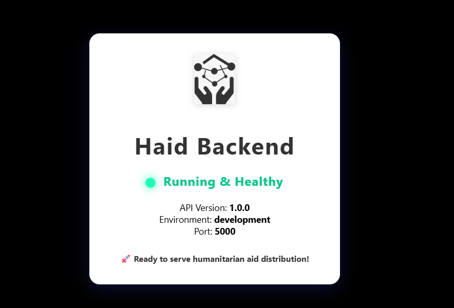

<div align="center">
  
  <h1>🌍 <b>Haid Humanitarian Aid Backend</b></h1>
  <p>
    <a href="https://github.com/Lideeyah/Haid/actions"></a>
    
    
    
    
  </p>
</div>

---

## 🏆 Project Title & Track

**Haid Humanitarian Aid Backend**  
Track: Blockchain for Social Good (Africa)  
Submission for the Hedera Africa Hackathon

---

## 🔗 GitHub Repository Link (Technical Documentation)

**Public Repo:** https://github.com/Lideeyah/Haid  
All code, documentation, and setup instructions are here.  
**Visibility:** Public (all branches open, no private code)

---

## 🌍 Overview
Haid is a secure, scalable backend for humanitarian aid distribution, built with Node.js, Express, and MongoDB Atlas. **All key actions are anchored on the Hedera Consensus Service (HCS) for tamperproof auditability.** The backend supports multiple user roles, robust event and scan tracking, and advanced dashboards for donors, NGOs, volunteers, and auditors. The API is fully documented with Swagger and designed for easy frontend integration. **All records (registration, events, scans, audits) are verifiable on-chain.**

---

## ⚡ Hedera Integration Summary

### Why Hedera?
We chose Hedera Consensus Service (HCS) for its immutable, low-cost, and high-throughput logging of all critical aid events (registration, distribution, audit). HCS’s predictable $0.0001 fee per transaction ensures operational cost stability—vital for humanitarian projects in Africa where every cent counts. ABFT finality and public verifiability mean all aid actions are tamperproof and auditable by anyone, building trust for donors and recipients alike.

### Hedera Services Used
- **Hedera Consensus Service (HCS):** Immutable logging of all registration, event, scan, and audit actions. Every key action is submitted as a TopicMessageSubmitTransaction to a dedicated HCS topic.
- **Hedera Account Management:** Each user (donor, NGO, beneficiary) receives a custodial Hedera account for HBAR-based donations and on-chain identity (DID anchoring).
- **HBAR Payments:** Donors send HBAR directly to NGOs/beneficiaries. All payments are logged and auditable.

### Transaction Types
- **TopicMessageSubmitTransaction:** For anchoring all critical events (registration, scan, audit) on HCS.
- **AccountCreateTransaction:** For creating custodial wallets for all users.
- **CryptoTransferTransaction:** For HBAR donations and aid disbursement.

### Economic Justification
Hedera’s low, predictable fees and high throughput make it uniquely suited for Africa’s humanitarian sector. With HCS, we can anchor every action for less than a cent, ensuring transparency without financial burden. HBAR’s fast, final settlement and negligible transfer costs enable micro-donations and real-time aid, supporting both financial sustainability and user adoption at scale.

---

## 🏗️ Architecture Diagram

<div align="center">
  
</div>

**Data Flow:**
- Frontend (UI) ↔️ Backend (Express API) ↔️ Hedera Network (HCS, Crypto, Mirror Node)
- All user actions (register, event, scan, audit, donation) are anchored on HCS. HBAR payments flow from donor → NGO/beneficiary via custodial wallets. Mirror Node is used for verification and audit.

---

## 🆔 Deployed Hedera IDs (Testnet)

- **HCS Topic ID:** `0.0.6928518`
- **Operator Account ID:** `0.0.6928106`
- **(Add any other contract/token IDs if used)**

---

## 🚀 Deployment & Setup Instructions

**Clone & Run in <10 Minutes:**
1. Clone the repo:
   ```sh
   git clone https://github.com/Lideeyah/Haid.git
   cd Haid
   ```
2. Install dependencies:
   ```sh
   npm install
   ```
3. Copy `.env.example` to `.env` and fill in your Hedera/MongoDB credentials (see below).
4. Start the backend:
   ```sh
   npm start
   ```
5. Visit [`http://localhost:5000/api-docs`](http://localhost:5000/api-docs) for Swagger API docs.

---

## 🖥️ Running Environment

- **Backend:** Node.js 18+, Express, MongoDB Atlas
- **Run:** `npm start` (backend on `localhost:5000`)
- **Swagger Docs:** `/api-docs`
- **Health Check:** `/health`

---

## 🛡️ Security & Secrets
- **No private keys or secrets are committed.**
- `.env.example` is provided for safe configuration.
- All sensitive credentials must be set in your own `.env` file.

---

## 📝 Example Configuration

See `.env.example` for required variables:

```env
PORT=5000
JWT_SECRET=your_jwt_secret
MONGO_URI=your_mongodb_atlas_uri
NODE_ENV=development
HEDERA_NET=testnet
OPERATOR_ID=0.0.xxxxxxx
OPERATOR_KEY=302e... (never commit real keys)
HEDERA_TOPIC_ID=0.0.xxxxxxx
```

---

## 🧑‍⚖️ Judge Credentials

Test account ID and Private Key are provided in the DoraHacks submission text field for verification. **Do not commit any real credentials to the repo.**

---

## 🧑‍💻 Author

**Nduoma Chinomso Christian**  
_AKA Buzz brain_

---

## 📚 Table of Contents
| Section | Description |
|---|---|
| [Live Hosted API](#live-hosted-api) | Hosted backend URLs |
| [Features](#features) | Key backend features |
| [Tech Stack](#tech-stack) | Technologies used |
| [Architecture](#architecture-diagram) | Project structure |
| [Quick Demo](#deployment--setup-instructions) | Fast local setup |
| [Environment Variables](#example-configuration) | Key .env settings |
| [Health Check](#health-check) | Backend status page |
| [User Roles](#user-roles) | Supported roles |
| [API Endpoints](#api-endpoints) | Endpoint details |
| [Sample Test Flow](#sample-test-flow) | Logical API journey |
| [Authentication](#authentication) | Auth logic |
| [Event & Aid Logic](#event--aid-logic) | Event/aid flow |
| [Dashboards](#dashboards) | Dashboard endpoints |
| [Error Handling](#error-handling) | Error responses |
| [Blockchain Roadmap](#blockchain-roadmap) | Future plans |
| [Setup & Usage](#deployment--setup-instructions) | Getting started |
| [Contributing](#contributing) | How to contribute |
| [License](#license) | License info |

---

## ✨ Features
* Multi-role authentication: Beneficiary, Donor, Volunteer, NGO, Auditor
* Event creation, volunteer assignment, and aid distribution tracking
* QR code generation for beneficiaries (**anchored DID, blockchain-backed**)
* **All key actions (registration, event, scan, audit) are anchored on Hedera Consensus Service for tamperproof records**
* Real-time scan logging, duplicate prevention, and audit trails
* Donor, NGO, and auditor dashboards with KPIs, impact, and **blockchain verification**
* Robust validation and error handling (including blockchain anchoring errors)
* Secure JWT authentication (HttpOnly cookies)
* Fully documented Swagger API (**all blockchain fields included**)

---

## 🛠️ Tech Stack
- **Node.js** & **Express.js**: RESTful API
- **MongoDB Atlas**: Cloud database
- **JWT**: Authentication
- **bcrypt**: Password hashing
- **Swagger**: API documentation
- **express-validator**: Request validation
- **helmet, morgan, winston**: Security & logging
- **@hashgraph/sdk**: Hedera integration
- **Axios**: Hedera Mirror Node API requests

---

## 👥 User Roles

| Role         | Description                                      | Key Endpoints                |
|--------------|--------------------------------------------------|------------------------------|
| Beneficiary  | Receives aid, has a QR code (**anchored DID, blockchain-backed**) | Registration                 |
| Donor        | Views impact dashboard, makes HBAR donations     | `/api/donor/dashboard`, `/api/donations` |
| Volunteer    | Assigned to events, scans beneficiaries          | `/api/scans`                 |
| NGO          | Creates events, manages volunteers                | `/api/events`, `/api/volunteers` |
| Auditor      | Verifies distribution, views audit dashboard     | `/api/auditor/dashboard`     |

---

## 🚦 API Endpoints

See [`API_DOC.md`](./API_DOC.md) for full API documentation, including request/response examples, error handling, and payment logic.

---

## 🏁 Code Quality & Auditability
- Clear, descriptive function names and consistent code style
- Inline comments for complex logic
- Linting with ESLint and Prettier (recommended)
- All core logic files are clean and auditable
- Standardized commit history

---

## 🤝 Contributing
- Please open issues or pull requests for improvements
- Blockchain integration is live—feedback welcome!

---

## 📄 License
MIT

---

## 🏁 Quick Reference
All endpoints, request/response schemas, blockchain fields (`did`, `hederaTx`), and audit logic are documented in Swagger (`/api-docs`).
For any questions, reach out via GitHub Issues.

## Overview
Haid is a secure, scalable backend for humanitarian aid distribution, built with Node.js, Express, and Prisma/PostgreSQL. **All key actions are anchored on the Hedera Consensus Service blockchain for tamperproof auditability.** The backend supports multiple user roles, robust event and scan tracking, and advanced dashboards for donors, NGOs, volunteers, and auditors. The API is fully documented with Swagger and designed for easy frontend integration. **All records (registration, events, scans, audits) are verifiable on-chain.**

---

## 🧑‍💻 Author

**Nduoma Chinomso Christian**  
_AKA Buzz brain_

---

## 📚 Table of Contents
| Section | Description |
|---|---|
| [Live Hosted API](#live-hosted-api) | Hosted backend URLs |
| [Features](#features) | Key backend features |
| [Tech Stack](#tech-stack) | Technologies used |
| [Architecture](#architecture) | Project structure |
| [Quick Demo](#quick-demo-run-locally-in-minutes) | Fast local setup |
| [Environment Variables](#environment-variables) | Key .env settings |
| [Health Check](#health-check) | Backend status page |
| [User Roles](#user-roles) | Supported roles |
| [API Endpoints](#api-endpoints) | Endpoint details |
| [Sample Test Flow](#sample-test-flow) | Logical API journey |
| [Authentication](#authentication) | Auth logic |
| [Event & Aid Logic](#event--aid-logic) | Event/aid flow |
| [Dashboards](#dashboards) | Dashboard endpoints |
| [Error Handling](#error-handling) | Error responses |
| [Blockchain Roadmap](#blockchain-roadmap) | Future plans |
| [Setup & Usage](#setup--usage) | Getting started |
| [Contributing](#contributing) | How to contribute |
| [License](#license) | License info |

---

## 🌐 Live Hosted API

The backend is live and ready to test:

- **Base URL:** [`https://haid.onrender.com`](https://haid.onrender.com)
- **Swagger Docs:** [`https://haid.onrender.com/api-docs`](https://haid.onrender.com/api-docs)
- **Health Check:** [`https://haid.onrender.com/health`](https://haid.onrender.com/health)

---

## ✨ Features
* Multi-role authentication: Beneficiary, Donor, Volunteer, NGO, Auditor
* Event creation, volunteer assignment, and aid distribution tracking
* QR code generation for beneficiaries (**anchored DID, blockchain-backed**)
* **All key actions (registration, event, scan, audit) are anchored on Hedera Consensus Service for tamperproof records**
* Real-time scan logging, duplicate prevention, and audit trails
* Donor, NGO, and auditor dashboards with KPIs, impact, and **blockchain verification**
* Robust validation and error handling (including blockchain anchoring errors)
* Secure JWT authentication (HttpOnly cookies)
* Fully documented Swagger API (**all blockchain fields included**)

---

## 🛠️ Tech Stack
- **Node.js** & **Express.js**: RESTful API
- **Prisma**: ORM for PostgreSQL
- **PostgreSQL**: Relational database
- **JWT**: Authentication
- **bcrypt**: Password hashing
- **Swagger**: API documentation
- **express-validator**: Request validation
 **helmet, morgan, winston**: Security & logging
 **Custom Content Security Policy (CSP)**: Allows images from Cloudinary for branding and UI (see `/health` endpoint and logo usage)
 **@hashgraph/sdk**: Hedera Consensus Service integration
 **Axios**: Hedera Mirror Node API requests


 * Modular controllers for each domain (auth, events, scans, dashboard, etc.)
 * Middleware for authentication, role checks, and error handling
 * Prisma schema for users, events, aid logs, and roles
 * Separation of validation logic in routes
 * DID generation utility (crypto keypair + hash for lightweight, anchored DIDs)
 * Hedera integration utility (all key actions logged and verified on-chain)
- Middleware for authentication, role checks, and error handling
- Prisma schema for users, events, aid logs, and roles
- Separation of validation logic in routes

---

## 🚀 Quick Demo: Run Locally in Minutes

Get started in 3 steps:

```sh
git clone https://github.com/Lideeyah/Haid.git
cd Haid
npm install
npm run dev
```

Then visit [`http://localhost:5000/api-docs`](http://localhost:5000/api-docs) for interactive Swagger docs.

---

## ⚙️ Environment Variables

| Variable         | Description                       |
|------------------|-----------------------------------|
| PORT             | Server port (default: 5000)       |
| JWT_SECRET       | JWT signing secret                |
| DATABASE_URL     | PostgreSQL connection string      |
| NODE_ENV         | Environment (development/production) |
| OPERATOR_ID      | Hedera account ID for blockchain anchoring |
| OPERATOR_KEY     | Hedera private key for signing transactions |
| HEDERA_TOPIC_ID  | Hedera topic/channel for logging events on-chain |

---

## 🩺 Health Check

**Endpoint:** `/health`

Displays a beautiful, professional HTML status page showing that the backend is running and healthy. Includes:
- Project logo (from Cloudinary)
- API version, environment, port
- Animated heartbeat and modern UI

**Screenshot:**


**Note:** If you use an external logo, ensure your backend CSP allows it (see below).

**Swagger Docs:** `/api-docs` (live API documentation)

---


## 👥 User Roles

| Role         | Description                                      | Key Endpoints                |
|--------------|--------------------------------------------------|------------------------------|
| Beneficiary  | Receives aid, has a QR code (**anchored DID, blockchain-backed**) | Registration                 |
| Donor        | Views impact dashboard                           | `/api/donor/dashboard`       |
| Volunteer    | Assigned to events, scans beneficiaries          | `/api/scans`                 |
| NGO          | Creates events, manages volunteers                | `/api/events`, `/api/volunteers` |
| Auditor      | Verifies distribution, views audit dashboard     | `/api/auditor/dashboard`     |

---


**Success Response:**
`200 OK`
```json
{
  "eventsCount": 10,
  "volunteersCount": 25,
  "beneficiariesCount": 120,
  "aidDistributed": 110,
  "aidTypes": ["food", "medicine"]
}
```

#### `GET /api/donor/dashboard`
**Get donor dashboard KPIs and impact (donor only, blockchain-anchored)**

**Success Response:**
`200 OK`
```json
{
  "recipientsServed": 120,
  "distributionProgress": {
    "totalEvents": 10,
    "completedEvents": 7,
    "percentCompleted": 70
  },
  "geographicImpact": [
    { "location": "Lagos", "events": 5 },
    { "location": "Abuja", "events": 2 }
  ]
}
```

#### `GET /api/auditor/dashboard`
**Get auditor dashboard logs and verification (auditor only, blockchain-anchored)**

**Query Params:**
- `eventId` (optional): Filter logs by event ID
- `date` (optional): Filter logs by date (YYYY-MM-DD)

**Success Response:**
`200 OK`
```json
{
  "logs": [
    {
      "did": "did:haid:...", // Anchored DID
      "hederaTx": {
        "status": "SUCCESS",
        "transactionId": "...",
        "sequenceNumber": 101,
        "runningHash": "..."
      },
      "status": "collected",
      "timestamp": "2025-09-29T12:34:56Z"
    }
  ],
  "guardianMatch": true
}
```
**Error Responses:**
`400 Bad Request`
```json
{
  "errors": [ { "msg": "Invalid date format. Use YYYY-MM-DD.", "param": "date", "location": "query" } ]
}
```
`404 Not Found`
```json
{
  "message": "Event not found."
}
```

---

## 🔐 Authentication
- JWT tokens are set in HttpOnly cookies after login
- All protected endpoints require authentication
- Role-based access enforced via middleware

---

## 🎫 Event & Aid Logic
- Events are created by NGOs, with volunteers assigned
- Beneficiaries receive a QR code (simulated DID)
- Volunteers scan QR codes to log aid distribution
- Duplicate scans are blocked and logged
- All actions timestamped for auditability

---

## 📊 Dashboards
### Donor Dashboard
- KPIs: Total recipients served, distribution progress, geographic impact
- Endpoint: `GET /api/donor/dashboard`
- Example response:
```json
{
  "recipientsServed": 120,
  "distributionProgress": {
    "totalEvents": 10,
    "completedEvents": 7,
    "percentCompleted": 70
  },
  "geographicImpact": [
    { "location": "Lagos", "events": 5 },
    { "location": "Abuja", "events": 2 }
  ]
}
```

### Auditor Dashboard
- View all aid logs, filter by event/date
- Compare logs with Hedera Guardian (future blockchain integration)
- Endpoint: `GET /api/auditor/dashboard?eventId=...&date=YYYY-MM-DD`
- Example response:
```json
{
  "logs": [
    {
      "eventId": "...",
      "beneficiaryId": "...",
      "volunteerId": "...",
      "timestamp": "2025-09-29T12:34:56Z",
      "status": "collected",
      "transactionId": "..."
    }
  ],
  "hederaMatch": true
}
```

### NGO/Admin Dashboard
- General stats: events, volunteers, beneficiaries, aid distributed, aid types
- Endpoint: `GET /api/dashboard/general-stats`
- Example response:
```json
{
  "eventsCount": 10,
  "volunteersCount": 25,
  "beneficiariesCount": 120,
  "aidDistributed": 110,
  "aidTypes": ["food", "medicine"]
}
```

---

## ❗ Error Handling
- All endpoints return detailed error messages and validation errors
- Example error response:
```json
{
  "errors": [
    { "msg": "Valid email is required", "param": "email", "location": "body" }
  ]
}
```
- Unauthorized, forbidden, not found, and duplicate actions are clearly indicated

---

## ⛓️ Blockchain Roadmap
**Current:** All key actions (registration, event, scan, audit) are anchored on Hedera Consensus Service. DIDs are generated and anchored on-chain, and all endpoints return blockchain transaction info (`hederaTx`).
**Live:** Auditor dashboard performs real-time verification against Hedera Mirror Node, flags any missing on-chain records.
**Future:** Further expand blockchain logic, add external indexer/mirror node matching, and enhance audit flows.

---

## 🚀 Setup & Usage
1. Clone the repo:
   ```sh
   git clone https://github.com/Lideeyah/Haid.git
   cd Haid
   ```
2. Install dependencies:
   ```sh
   npm install
   ```
3. Set up environment variables in `.env` (see `.env.example`)
4. Run Prisma migrations:
   ```sh
   npx prisma migrate deploy
   ```
5. Start the server:
   ```sh
   npm start
   ```
6. Access Swagger docs at `/api-docs`

---

## 🤝 Contributing
- Please open issues or pull requests for improvements
- Blockchain integration is coming soon—feedback welcome!

---

## 📄 License
MIT

---

- Health check endpoint (`/health`) with stunning HTML status page for live backend status.
- README and health page visuals enhanced for professional presentation.
- API responses include HTTP status codes for frontend clarity.
- Clear, consistent, and predictable endpoints
- Role-based access and validation for security
- All responses are structured for easy frontend consumption
- Swagger docs provide live, interactive API reference
- Future-proof: ready for blockchain integration

---

## 🏁 Quick Reference
All endpoints, request/response schemas, blockchain fields (`did`, `hederaTx`), and audit logic are documented in Swagger (`/api-docs`).
For any questions, reach out via GitHub Issues

